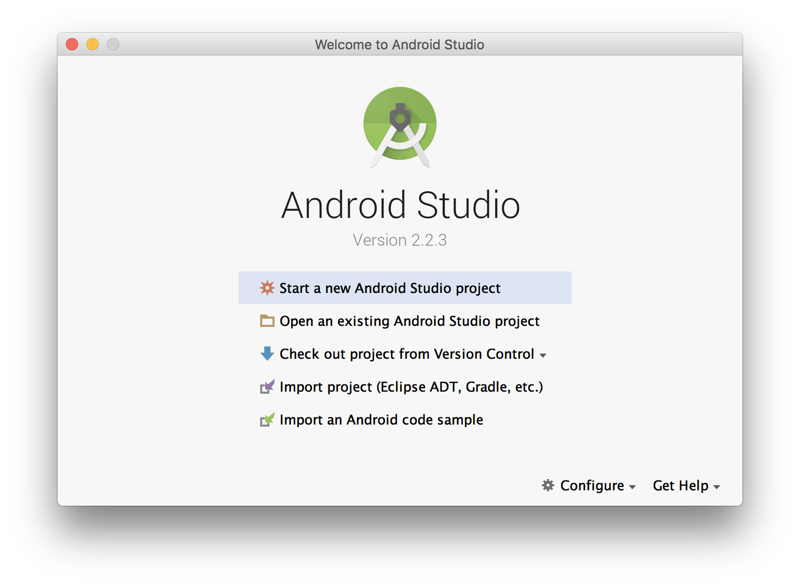

## Create New Android Project

### Step 1. Dashboard > Start a new Android Studio Project

### Step 2. Configure your new project

> Application Name : 안드로이드 어플리케이션의 이름을 작성합니다. 
> Company Name : Android Application 을 구분지을 패키지 명을 작성합니다. 일반적으로 회사의 `도메인`을 입력합니다. 
> Package Name : Company Name 과 Application Name이 결합된 이름이 작성됩니다. Company Name은 역순으로 작성됩니다. 이 Package Name 은 앞으로 Android Play Store 에서 Android Application을 대표 하는 값으로 사용됩니다.

Next 를 클릭해 다음으로 진행
